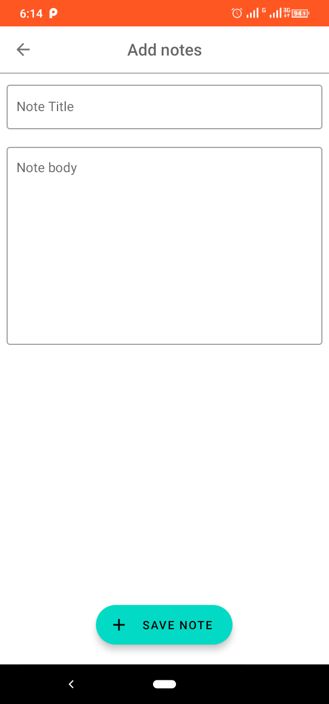
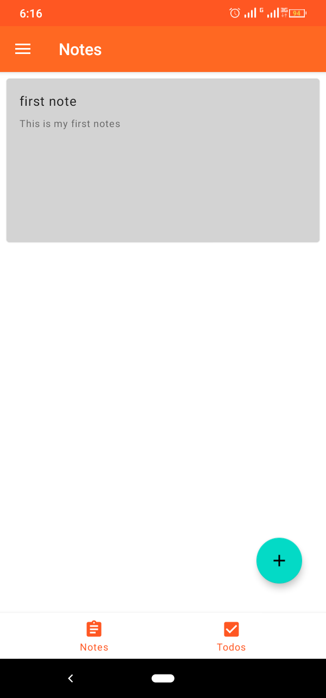
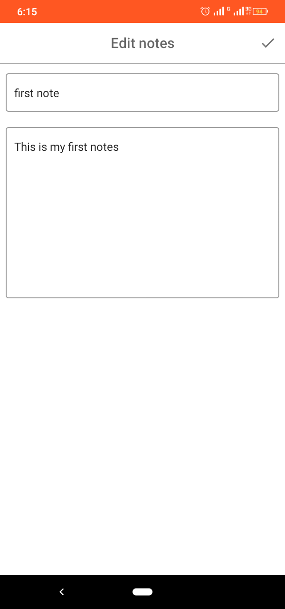
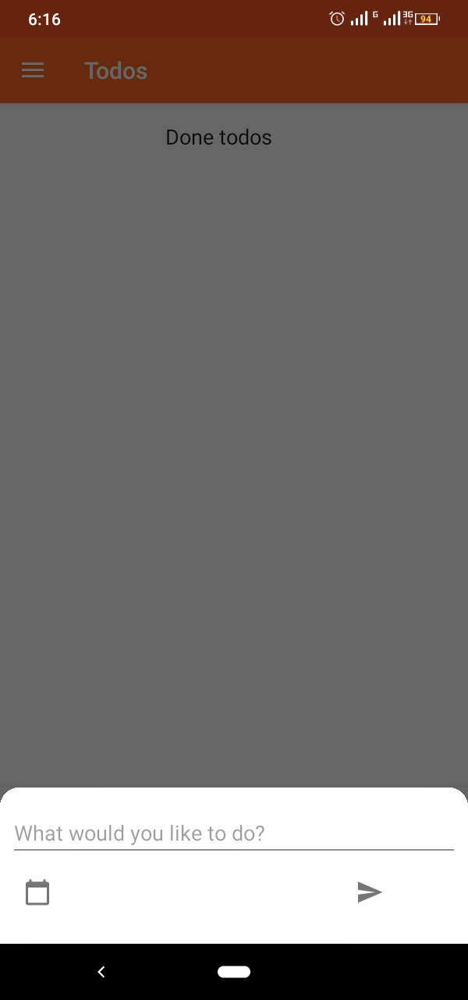
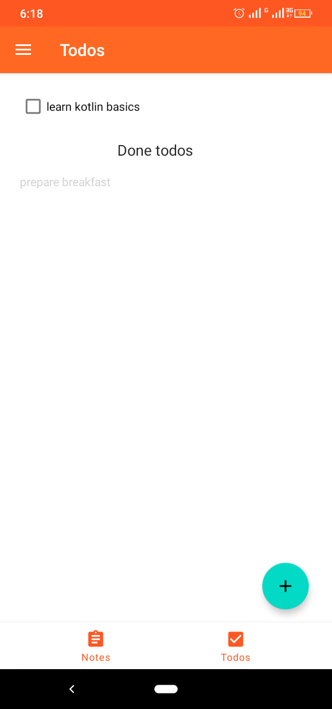
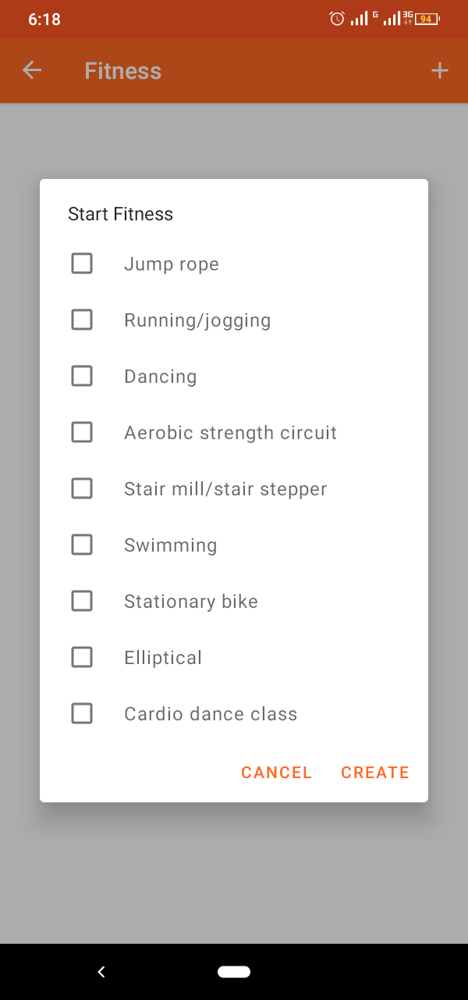
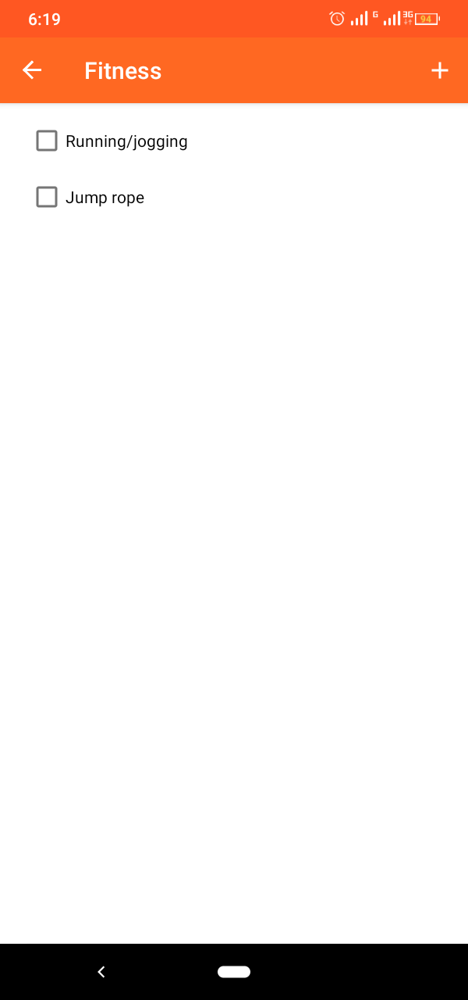
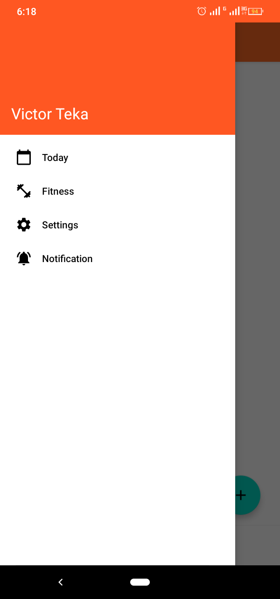

#My Reminder
An android app for taking notes, writing todos and recording fitness exercise someone is doing.
I built so as to learn how to use sqlite and room library in Android

Build System : [Gradle](https://gradle.org/)

## Libraries

Libraries used in the whole application are:

- [Jetpack](https://developer.android.com/jetpack)🚀
  - [Viewmodel](https://developer.android.com/topic/libraries/architecture/viewmodel) - Manage UI related data in a lifecycle conscious way
  and act as a channel between use cases and ui
  - [Data Binding](https://developer.android.com/topic/libraries/data-binding) - support library that allows binding of UI components in  layouts to data sources,binds character details and search results to UI
  - [Room](https://developer.android.com/training/data-storage/room) - Provides abstraction layer over SQLite

- [kotlinx.coroutines](https://github.com/Kotlin/kotlinx.coroutines) - Library Support for coroutines,provides `runBlocking` coroutine builder used in tests
- [Material Design](https://material.io/develop/android/docs/getting-started/) - build awesome beautiful UIs.🔥🔥

## Demo

|||||
|:----:|:----:|:----:|:----:|

|||||
|:----:|:----:|:----:|:----:|

## \[ 🚧 Work in progress 👷‍♀️⛏👷🔧️👷🔧 🚧 \]